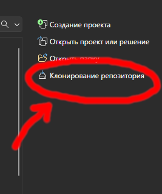
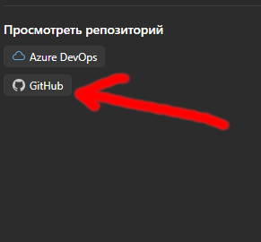
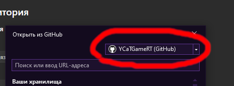
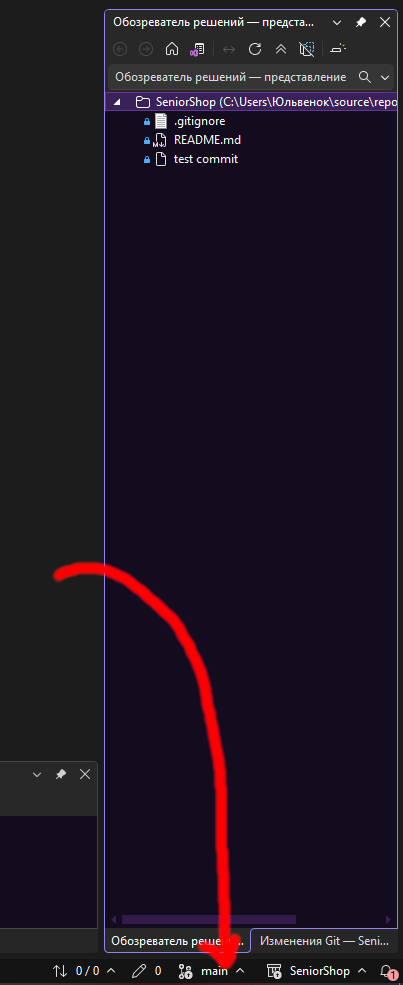
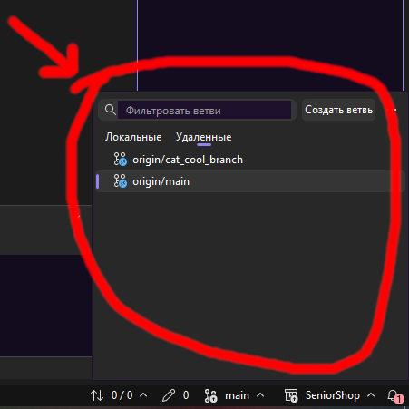

# А как вообще?
## Описание
Всем привет!

Это будет классный гайд как вообще работать с репозиторием проекта и как вносить в него изменения

Если вы что нибудь забудите то можете подсмотреть это здесь

## О ветках
Здесь будет вся инфа как работать с ветками что бы легче работать в комманде т.к. сейчас у нас может кто угодно отправлять коммиты куда угодно (классная анархия)
### Как создать свою ветку
Для начала ван нужно сделать свою ветку

Первым делом перейдите в [ветки](https://github.com/SeniorShop/SeniorShop/branches) и нажмите на кнопку создания ветки

Затем **вам надо будет выбрать в Source ветку** `unstable` и ввести название своей ветки на английском в стиле my_branch_name и нажать на кнопку создания

Поздравляю! Вы создали свою собственную ветку и можете посмотреть её на главной странице репозетория выбрав в списке

### Как писать изменения в ветках
Что бы писать код в своей ветке в VS вам нужно сначала нужно клонировать репозиторий **ЕСЛИ ВЫ ЭТОГО ЕЩЁ НЕ СДЕЛАЛИ** (иначе пропустите этот пункт)

И после этого у вас откроется корень проекта где много всякого хлама

Но не паникуем и просто выходим и в первом окне VS с проектами у вас появится `SeniorShop.sln` и просто откройте его как обычный проект

Что бы перейти конкретно в свою ветку под обозревателем решений найдите надписть иконку веток и имя дэфолтной ветки `main` и нажмите туда

После этого в открывшемся окне вы найдёте свою созданную ветку и сможете переключится в неё и выполнить задачу

### Как отправить запрос на слияние веток
А тут о том как оповещать Андрея о изменениях и проделанной работе